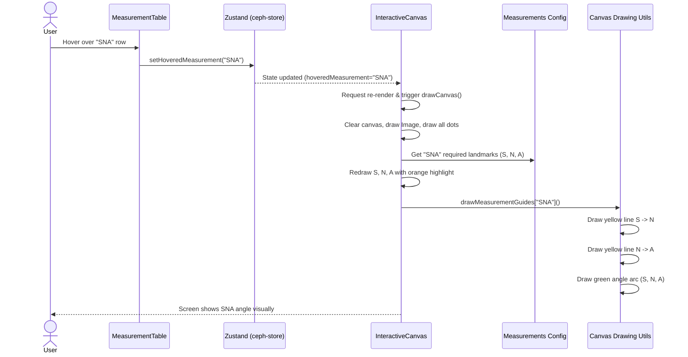

# Data Lifecycle & Interaction Flow in Cephalometric Analysis

This document explains how data moves through the application, from the moment an image is loaded to the moment a specific angle is drawn on the canvas. 

## 1. The Core State (The "Brain")
Everything revolves around the **Zustand Store** (`useCephStore`). Think of the store as the single source of truth. It holds:
- The image (`loadedImageSrc`)
- The coordinates of all landmarks (`landmarksObj`)
- The calculated measurements like angles and distances (`measurements`)
- The current interaction state, like what the user is hovering over (`hoveredMeasurement`)

No component "owns" this data. Instead, components like the `MeasurementTable` and `InteractiveCanvas` **subscribe** to the store. When the store changes, these components automatically re-render.

---

## 2. The Data Lifecycle (Start to Finish)

### Phase A: Initialization & AI Prediction
1. **Upload:** User uploads an X-Ray image. The image is sent to the AI API.
2. **Detection:** The AI returns an array of landmarks (e.g., `[ { symbol: 'S', x: 100, y: 200 }, ... ]`).
3. **Calculation:** Before saving to the store, the app calculates all angles and distances using `calculateAllMeasurements()` based on these landmarks.
4. **Storage:** The landmarks and calculated measurements are saved into `useCephStore`.

### Phase B: First Render
1. **Table:** The `MeasurementTable` reads the `measurements` from the store and renders the rows (SNA, SNB, etc.).
2. **Canvas:** The `InteractiveCanvas` reads the image and `landmarksObj` from the store. Its `useEffect` triggers the `drawCanvas()` function, painting the X-Ray and drawing red dots for every landmark.

---

## 3. Deep Dive: How an Angle is Drawn (Interaction Loop)

Let's look at exactly what happens when you hover over the **"SNA"** angle in the table. How does that hover turn into a green angle arc on the image?

### Step 1: The Trigger
You move your mouse over the "SNA" row in the `MeasurementTable`.
```tsx
// Inside MeasurementTable.tsx
<tr onMouseEnter={() => setHoveredMeasurement("SNA")}>
```

### Step 2: Store Update
The `setHoveredMeasurement` function tells the Zustand store: *"Hey, the user is looking at SNA!"*
```tsx
// Inside ceph-store.ts
setHoveredMeasurement: (measurement) => set({ hoveredMeasurement: measurement })
```

### Step 3: Canvas Reaction
The `InteractiveCanvas` is actively watching `hoveredMeasurement`. Because the state changed from `null` to `"SNA"`, React re-renders the canvas component.
```tsx
// Inside InteractiveCanvas.tsx
const hoveredMeasurement = useCephStore((state) => state.hoveredMeasurement); // Now equals "SNA"

// This useEffect runs because hoveredMeasurement changed
useEffect(() => {
  drawCanvas();
}, [..., hoveredMeasurement, ...]);
```

### Step 4: The Drawing Logic (`drawCanvas`)
Inside `drawCanvas()`, the canvas gets cleared and redrawn from scratch. It draws the image, then the landmarks. Then it reaches this block:

```tsx
if (hoveredMeasurement && drawMeasurementGuides[hoveredMeasurement]) {
  // 1. Look up SNA configuration
  const config = MEASUREMENTS_CONFIG["SNA"]; 
  
  // 2. Highlight specific landmarks (S, N, and A)
  config.landmarks.forEach(symbol => {
    drawLandmark(..., symbol, true); // Draws them with an orange glow
  });

  // 3. Draw the actual lines and angle arc
  drawMeasurementGuides["SNA"](ctx, landmarksObj, renderScale);
}
```

### Step 5: Painting the Geometry
Finally, the execution jumps to `canvas-drawing.ts`, where the specific rules for drawing "SNA" live.
```tsx
// Inside canvas-drawing.ts
"SNA": (ctx, landmarks, scale) => {
  const { S, N, A } = landmarks;
  
  // Draw yellow line from S to N
  drawLine(ctx, S, N, scale, '#FFFF00', 2);
  
  // Draw yellow line from N to A
  drawLine(ctx, N, A, scale, '#FFFF00', 2);
  
  // Mathematically calculate the arc between S-N and N-A, and draw it in green
  drawAngleArc(ctx, S, N, A, scale, '#00FF00');
}
```

---

## 4. Visual Diagram



## Summary
The UI components (`MeasurementTable`, `InteractiveCanvas`) **never talk to each other directly**. 
- The Table talks to the Store.
- The Store notifies the Canvas.
- The Canvas reads instructions (from Config) on how to translate that data into lines and arcs.